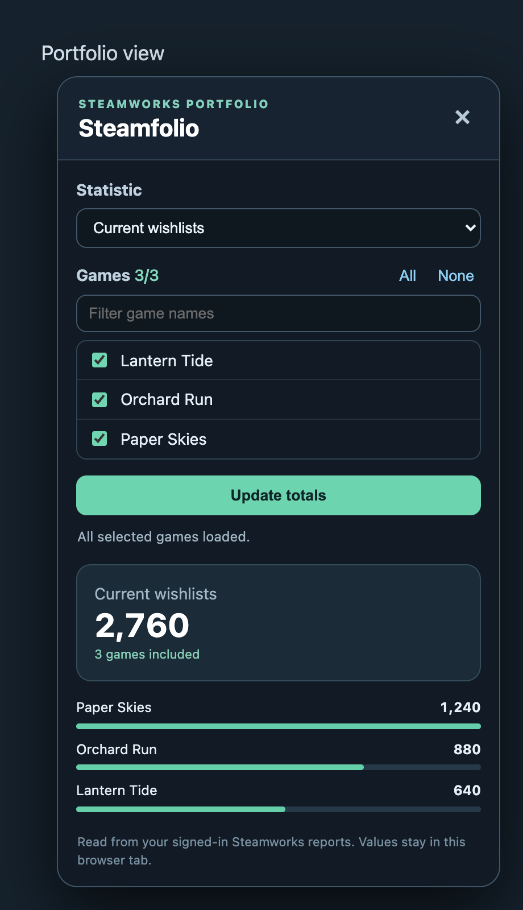
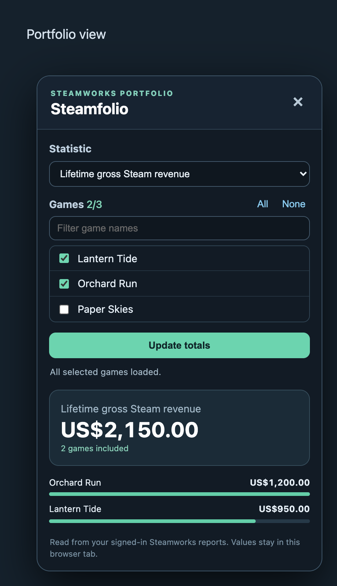

# Steamfolio

See one Steamworks statistic across any selection of your games.

Example view with illustrative game names and figures.

## Install

1. Download and extract the repository.
2. Open `chrome://extensions`, enable **Developer mode**, and choose **Load unpacked**.
3. Select the extracted `steamfolio` folder.
4. Sign in to [Steamworks Sales & Activations](https://partner.steampowered.com/) and open any page there.

## Use

Click the small chart button at the lower right of a Steamworks report page. Choose a statistic, select one or more games, and set dates for period statistics. The large number is the total across the selected games; the bars show each game's contribution. Use **Update totals** to read the reports again.

Your game selection, statistic, and dates are remembered in this Chrome profile. **None** clears the selection; choose at least one game to see a total.

## What it reads

Steamfolio reads the game directory and the relevant reports available to your signed-in Steamworks account. It does not change reports or games, request an API key, or send results to another service. Your choices are saved in Chrome's local extension storage; report values stay in the current tab. See the [privacy policy](PRIVACY.md) for details.

## Limits

Steamfolio shows only the statistics available in the Steamworks reports it can read. Some games may lack a figure for a selected period. When that happens, it lists the unavailable games and withholds the combined total. Revenue is shown in US dollars using Steamworks' own gross or net label. Period revenue is the report's gross estimate and can differ from settled monthly payments. Wishlist activity balance is activity during the chosen dates; **Current wishlists** is the outstanding count. Dates follow the Steamworks report's day boundaries.

## License

MIT. See [LICENSE](LICENSE).
